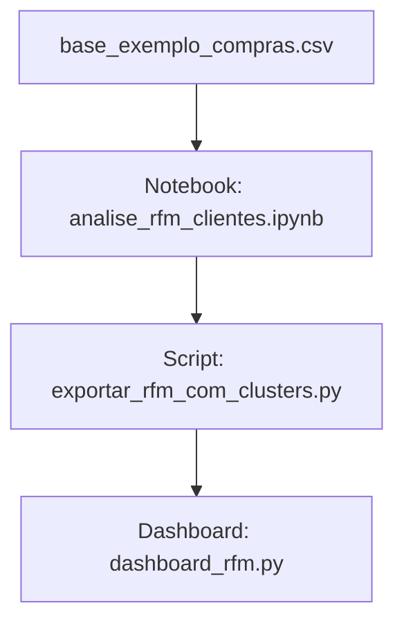

# 🧱 Mapa de Componentes - Segmentação de Clientes com RFM

Este documento descreve os principais componentes do sistema e suas responsabilidades no pipeline de análise RFM com visualização interativa.

---

## 📂 Componentes Funcionais

### 📥 1. Entrada de Dados (Ingestão)
- **Componente**: `base_exemplo_compras.csv`
- **Função**: Armazena os registros brutos de compras de clientes.
- **Formato**: CSV contendo `customer_id`, `purchase_date`, `purchase_value`.

---

### 🧠 2. Processamento e Análise (Núcleo de Inteligência)
- **Componente**: `analise_rfm_clientes.ipynb`
- **Função**: Cálculo dos indicadores RFM (Recency, Frequency, Monetary), normalização e clusterização.
- **Bibliotecas**: `pandas`, `scikit-learn`, `datetime`.
- **Saída intermediária**: DataFrame com scores RFM e cluster associado.

---

### 🛠️ 3. Geração de Artefato Final
- **Componente**: `exportar_rfm_com_clusters.py`
- **Função**: Exporta os dados com clusters em formato CSV.
- **Resultado**: `rfm_com_clusters.csv`, usado como entrada para o dashboard.

---

### 📊 4. Visualização Interativa
- **Componente**: `dashboard_rfm.py`
- **Framework**: `Streamlit`
- **Funções**:
  - Upload do CSV com clusters.
  - Filtros por grupo de cliente.
  - Visualizações com `seaborn` e `matplotlib`.

---

## 🔁 Relações entre os Componentes

> *Observação*: O fluxo pode ser facilmente automatizado ou expandido para pipelines ETL contínuos.

---

## 🚀 Extensões Futuras

- Substituir entrada manual por banco de dados relacional (PostgreSQL, MySQL).
- Automatizar execução via scheduler (Airflow, cron).
- Criar microserviços para processamento e visualização.

---

Este mapa auxilia na compreensão modular do sistema e serve como referência para manutenções ou melhorias.
